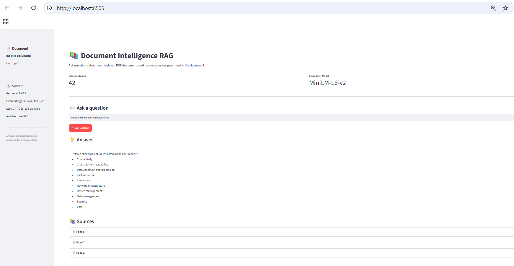
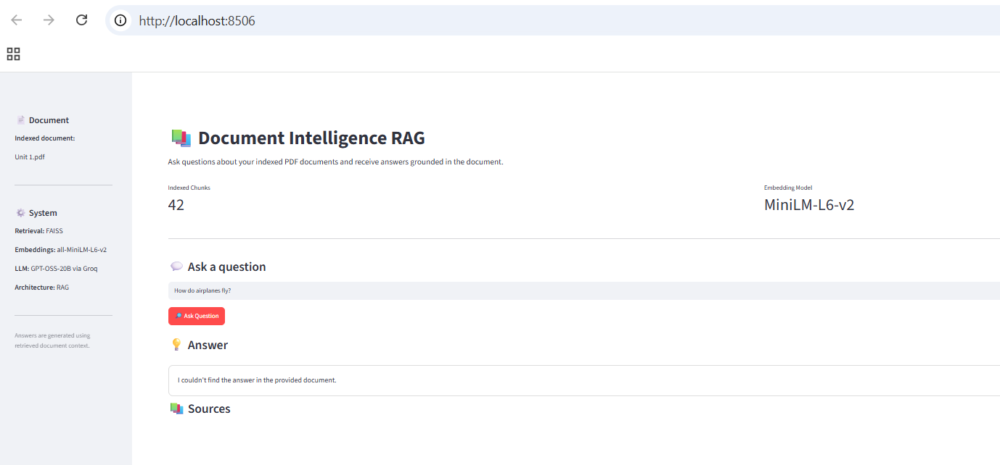

#  Document Intelligence RAG

A document-grounded question-answering application built with Retrieval-Augmented Generation (RAG). It allows users to ask questions about indexed PDF documents and receive answers grounded in the document content.

##  Project Overview

Large documents can contain useful information that is difficult to find manually.

This project provides a simple way to ask natural-language questions about a document and receive an answer based onldocument-y on the information available in that document.

The application:

- Extracts text from PDF documents
- Splits documents into smaller chunks
- Generates semantic embeddings
- Stores embeddings using FAISS
- Retrieves the most relevant document chunks
- Sends retrieved context to an LLM through the Groq API
- Generates document-grounded answers
- Displays relevant source pages
- Refuses to answer when the requested information is not found in the document

##  Architecture

```text
                    PDF DOCUMENT
                         │
                         ▼
                ┌─────────────────┐
                │ Document Loader │
                └────────┬────────┘
                         │
                         ▼
                   Text Chunking
                         │
                         ▼
              Sentence Transformers
                   Embeddings
                         │
                         ▼
                ┌─────────────────┐
                │      FAISS      │
                │  Vector Store   │
                └────────┬────────┘
                         │
                         ▼
                  Persistent Store
                  index.faiss
                  chunks.json
                         │
                         ▼
                  User Question
                         │
                         ▼
                  Query Embedding
                         │
                         ▼
                    FAISS Search
                         │
                         ▼
                 Top-k Relevant
                    Chunks
                         │
                         ▼
                 ┌──────────────┐
                 │   Groq API   │
                 │  GPT-OSS-20B │
                 └──────┬───────┘
                        │
                        ▼
                  Grounded Answer
                        │
                        ▼
                   Streamlit UI


```
##  RAG Workflow

### 1. Document Ingestion

The PDF document is loaded and its text is extracted.

```text
PDF → Extracted Text
```

### 2. Text Chunking

The extracted text is divided into smaller chunks for efficient retrieval.

```text
Document → Text Chunks
```

### 3. Embedding Generation

Each text chunk is converted into a vector using the `all-MiniLM-L6-v2` sentence-transformer model.

```text
Text Chunk → 384-dimensional embedding
```

### 4. Vector Storage

The embeddings are indexed using FAISS.

The vector store is persisted locally as:

```text
index.faiss
chunks.json
```

### 5. Query Retrieval

When a user asks a question:

```text
Question
   ↓
Question Embedding
   ↓
FAISS Similarity Search
   ↓
Top-k Relevant Chunks
```

### 6. Answer Generation

The retrieved document chunks are provided as context to GPT-OSS-20B through the Groq API.

The model is instructed to answer only using the retrieved document context.

```text
Question + Retrieved Context
            ↓
         Groq API
            ↓
       GPT-OSS-20B
            ↓
          Answer
```

##  Tech Stack

| Technology | Purpose |
|---|---|
| Python | Core programming language |
| Streamlit | Web application interface |
| PyPDF | PDF text extraction |
| Sentence Transformers | Text embeddings |
| FAISS | Vector similarity search |
| Groq API | LLM inference |
| GPT-OSS-20B | Answer generation |
| python-dotenv | Environment variable management |
| NumPy | Numerical operations |

##  Features

-  PDF document question answering
-  Semantic vector search
-  Sentence Transformer embeddings
-  Persistent FAISS vector store
-  Groq API-powered answer generation
-  Source page display
-  Out-of-document question handling
-  Streamlit interface

##  Evaluation

The RAG system was tested with six representative questions.

| Test Case | Expected Behavior | Result |
|---|---|---|
| What is the Internet of Things? | Answer | ✅ PASS |
| What are the main challenges of IoT? | Answer | ✅ PASS |
| How is IoT used in smart grids? | Answer | ✅ PASS |
| What is GPS used for in smartphones? | Answer | ✅ PASS |
| How do airplanes fly? | Refuse | ✅ PASS |
| What is photosynthesis? | Refuse | ✅ PASS |

**Result: 6/6 expected behavioral outcomes passed.**

> Note: This is a small functional evaluation set and should not be interpreted as a general accuracy benchmark.

##  Application Screenshots

### Document-Grounded Answer

The application retrieves relevant information from the indexed document and generates a grounded answer using the Groq API.



### Out-of-Document Question

The system refuses to answer when the requested information is not available in the indexed document.



##  Project Structure

```text
document-intelligence-rag/
│
├── app.py
├── evaluate_rag.py
├── requirements.txt
├── README.md
├── .gitignore
│
├── data/
│   ├── documents/
│   └── vector_store/
│
├── screenshot/
│   ├── rag-answer.png
│   └── out-of-document.png
│
├── src/
│   ├── __init__.py
│   ├── document_loader.py
│   ├── embeddings.py
│   ├── rag_pipeline.py
│   ├── text_splitter.py
│   └── vector_store.py
│
├── test_loader.py
├── test_groq.py
└── test_groq_models.py
```

##  Installation

### 1. Clone the repository

```bash
git clone https://github.com/pratiksha18r/document-intelligence-rag.git
cd document-intelligence-rag
```

### 2. Create a virtual environment

```bash
python -m venv .venv
```

On Windows PowerShell:

```powershell
.venv\Scripts\activate
```

### 3. Install dependencies

```bash
pip install -r requirements.txt
```

### 4. Configure the Groq API key

Create a `.env` file in the project root:

```text
GROQ_API_KEY=your_groq_api_key
```

Never commit the `.env` file to GitHub.

##  Prepare the Vector Store

The FAISS vector store is generated locally and is excluded from GitHub.

After setting up the project, run the ingestion pipeline:

```bash
python test_loader.py
```

This processes the document, generates embeddings, creates the FAISS index, and saves the vector store locally.

The generated files are:

```text
data/vector_store/
├── index.faiss
└── chunks.json
```

##  Run the Application

After creating the vector store, start the Streamlit application:

```bash
streamlit run app.py
```

The application will open in your browser.

##  Security

Sensitive and generated files are excluded from Git using `.gitignore`.

The Groq API key is loaded through an environment variable and is not stored directly in the source code.

##  Current Limitations

- Currently designed around a locally indexed document.
- The evaluation dataset is intentionally small.
- Retrieval currently uses a fixed top-k value.
- The application does not yet provide an in-app document upload workflow.
- Retrieval quality depends on chunking and embedding choices.

##  Future Improvements

- Multiple-document support
- In-app PDF upload and indexing
- Improved retrieval evaluation
- Similarity thresholding
- Reranking retrieved chunks
- Conversation history
- Streaming LLM responses
- More detailed source citations
- Automated test suite
- Cloud deployment

##  Author

**Pratiksha Bodkhe**

MCA | Artificial Intelligence & Machine Learning
Interested in Artificial Intelligence, Machine Learning, Data Science, and Software Development.
